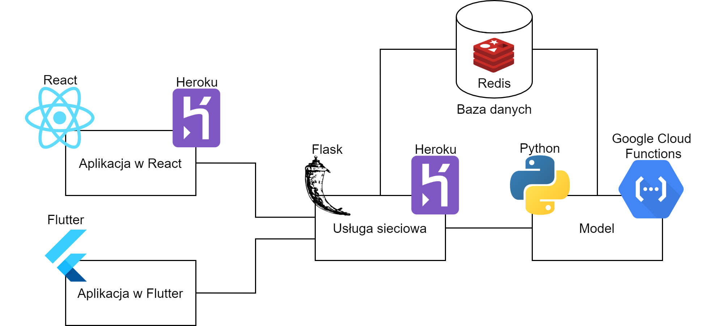

# Timber - Wirtualna swatka – wybór najlepszego partnera

Zakres pracy:

* aplikacja webowa jako interfejs dla użytkownika,
* aplikacja mobilna na Androida/iOS,
* analiza istotności cech doboru partnera,
* wytrenowanie modelu oceniającego szanse na udany związek.